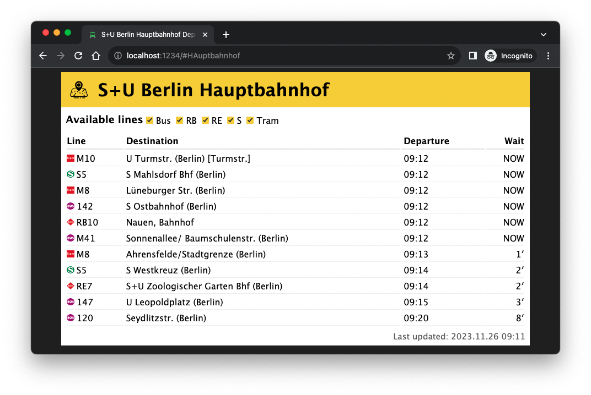

# my-stop

This is a simple webapp that display the upcoming departures of a specific station in Berlin.

The information is obtained from [https://v6.bvg.transport.rest/](https://v6.bvg.transport.rest/), which is a wrapper of a BVG API.

The app is currently deployed [here](https://my-stop.netlify.app/). You can search for a stop by adding it to the location hash. For example: `https://my-stop.netlify.app/#ostkreuz`.



## Getting Started

First, run the development server:

```bash
npm start
```

This will start a development server at http://localhost:1234.

To run the production build:

```bash
npm run build
```

## Acknowledgements

The font used is [Handjet](https://github.com/rosettatype/handjet), which is licensed under the OFL-1.1 license.